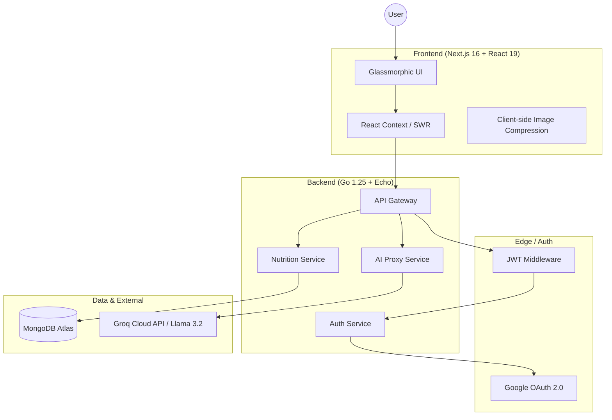

# ⚖️ SomDun (สมดุล) — Full-Stack AI-Powered Health & Nutrition Ecosystem

**SomDun** is a professional-grade health tracking platform that demonstrates a sophisticated integration of modern web technologies, AI-driven insights, and high-performance backend engineering. Designed with a "Mobile-First" philosophy and a premium glassmorphic aesthetic, it simplifies complex health data into actionable, gamified performance metrics.

---

## 🛠️ Engineering Overview

This project showcases a robust implementation of modern full-stack patterns, focusing on **Performance**, **User Experience**, and **Data Integrity**. Key technical achievements include:
- **Refined AI Vision Pipeline**: A multi-stage processing engine with dual-vision prompt ensembles for high-accuracy nutritional analysis.
- **High-Concurrency Backend**: A Go/Echo architecture optimized for low-latency API response times and structured data normalization.
- **Reactive Frontend**: A cutting-edge Next.js 16 implementation utilizing React 19 features, Tailwind 4, and Framer Motion for premium micro-interactions.

### 🏗️ System Architecture



---

## 🚀 Technical Highlights & Engineering Challenges

### 1. Multi-Modal AI Pipeline (Vision + LLM)
I implemented a sophisticated AI pipeline that transforms food imagery into structured nutritional intelligence.
- **Challenge**: Passing high-resolution images to the AI models often led to increased latency and potential payload failures on unstable mobile networks.
- **Solution**: Developed a **client-side image processing utility** that performs lightning-fast compression before transmission, reducing payload size by ~80%.
- **Optimization**: Implemented a **Multi-Stage Vision Ensemble** that combines results from multiple model passes to ensure accuracy even with complex, multi-item meals.

### 2. The "Athlete Player Card" Algorithm
A core gamification engine that calculates a dynamic "Performance Rating" (OVR) by aggregating multi-dimensional health data:
- **Nutrition Compliance**: Real-time tracking of macros vs. personalized goals.
- **Exercise & Recovery**: Granular tracking of physical activity and sleep data.
- **Hydration Syncing**: Visual tracking of water intake.
*Technical Detail*: Utilizes complex MongoDB aggregation pipelines to compute rolling averages and performance trends across time-series health data.

### 3. Integrated Body Measurement Analytics
To provide a holistic view of progress, the system tracks and validates body measurements:
- **Challenge**: Frontend input for measurements often suffers from inconsistent data types (string vs number) and range validation issues.
- **Solution**: Implemented a **Strict Validation Layer** in both Go and Next.js, ensuring weight, waist, and body fat entries are deterministic, positive, and correctly typed before persistence.

### 4. Premium Design System (Serene Balance)
- **Aesthetics**: A fully custom design system using **Vanilla CSS 4** and **Tailwind 4** to implement a consistent, premium glassmorphic UI.
- **Performance**: Optimized rendering using **React 19 Server Components** and `swr` for efficient data fetching and caching.

---

## 🧰 Tech Stack

| Layer | Technologies |
| :--- | :--- |
| **Frontend** | Next.js 16 (App Router), React 19, TypeScript, Framer Motion, Recharts, Tailwind 4 |
| **Backend** | Go 1.25, Echo Framework, JWT, Google OAuth 2.0 |
| **Database** | MongoDB Atlas (NoSQL) |
| **AI/ML** | Groq Cloud API (Llama 3.2 Vision, OpenAI GPT-OSS-120B) |
| **Infrastructure** | Docker, GitHub Actions CI/CD |

---

## 📂 Project Structure

```text
├── backend/                # Go (Golang) Microservice
│   ├── cmd/api/            # Application entry point & DI
│   ├── internal/           # Handlers, Models, Repositories (Domain-Driven)
│   └── tests/              # End-to-end integration tests
├── frontend/               # Next.js 16 Web Application
│   ├── src/app/            # App Router, Layouts, & Pages
│   ├── src/components/     # UI Design System
│   └── src/context/        # Global State (Auth, Language, UI)
└── docker-compose.yml      # Containerized orchestration
```

---

## 🏁 Development Setup

### 1. Prerequisites
- **Go** 1.25+ | **Node.js** 20+ | **MongoDB Atlas** account

### 2. Implementation
Clone the repository and configure the environment:
- Create `.env` in `/backend` (see `.env.example`)
- Create `.env.local` in `/frontend`

### 3. Run Locally
```bash
# Backend
cd backend && go run ./cmd/api/main.go

# Frontend
cd frontend && npm run dev
```

---

## ⚖️ Portfolio Context
This project was engineered by **KopPuntorn** to demonstrate proficiency in modern full-stack architecture, AI integration, and high-quality UI/UX delivery. It solves real-world technical problems (CORS, data aggregation, AI latency) while providing a premium user experience.

---
Developed with a focus on **Scalability**, **Performance**, and **User Experience**.
